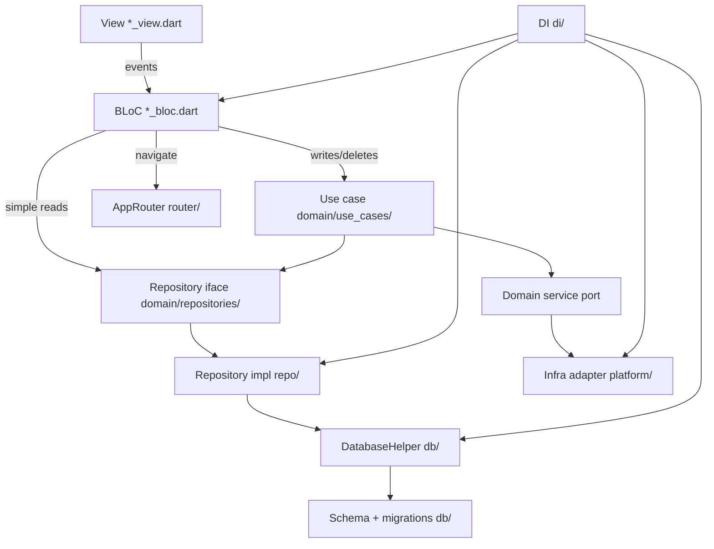

# Architecture — Carport

Carport is a Flutter car-maintenance tracker with a layered architecture: the
domain stays pure (no Flutter / UI / DB / plugins), and every other layer
depends inward. Presentation talks to use cases and repository interfaces;
concrete I/O lives in `repo/`, `db/`, and `platform/`.

## Layers

Order from innermost (most pure, fewest dependencies) to outermost.

| Layer | Directory | Responsibility | May depend on |
|-------|-----------|----------------|---------------|
| Domain | `lib/domain/` | Entities, models (SQL/row mappers), repository interfaces, service ports, use cases, formatters, validators, mappers. Pure — no Flutter. | (nothing internal) |
| Data-access | `lib/repo/` | Repository implementations that fulfil domain interfaces. | Domain, DB |
| Persistence | `lib/db/` | `DatabaseHelper` (connection + SQL CRUD), schema, migrations. | Domain (models) |
| Infra adapters | `lib/platform/` | OS/plugin adapters implementing domain service ports (notifications, file storage, portal HTTP, QR preview, biometrics). | Domain |
| Presentation | `lib/screens/` | Views + BLoCs. Views render; BLoCs hold logic and navigation. | Domain, router, di, theme, logger |
| Cross-cutting | `lib/router/`, `lib/di/`, `lib/theme/`, `lib/logger/` | Routing (`AppRouter` / `AppRoutes`), GetIt wiring, design tokens, shared logger. | Domain + presentation as needed |

## Core rules

1. **BLoC** performs writes/deletes through a **use case** and simple reads
   through a **repository** (domain interface).
2. **All navigation happens in BLoCs** — never in views or shared widgets.
   Every screen must be registered with a route in `lib/router/` (`AppRoutes`).
   Views only dispatch events (e.g. `backTapped`); the BLoC navigates by calling
   `AppRouter`. Views must not import `go_router` or `AppRouter`.
3. **No infrastructure plugins in BLoCs or views** — infrastructure is reached
   only through domain ports implemented in `lib/platform/` / `lib/repo/`.
4. **The domain is pure** — it must not import any outer layer or Flutter.
5. **Portal HTTP calls** are made from `lib/platform/` (`HttpPortalMonitorApi`),
   not from controllers/views. Outcome logging today is in sync/register **use
   cases** via `logSuccess` / `logFailure` / `logSkipped` (`lib/logger/`) —
   there is no shared HTTP-client interceptor yet. Temporary diagnostic logs:
   `logger.d` only — remove before finishing.

## Logger setup

Centralize the `logger` package in `lib/logger/logger.dart`. Prefer the helpers
`logSuccess`, `logFailure`, and `logSkipped` for completed operations:

```dart
import 'package:logger/logger.dart';

// One log line per operation at completion — no "calling/starting" info logs.
// Failures include a short stack trace from the catch site (not the throw site).

final logger = Logger(
  printer: PrettyPrinter(
    methodCount: 1,
    errorMethodCount: 1,
    lineLength: 120,
    excludePaths: ['package:carport/logger'],
  ),
);

void logSuccess(String message) => logger.i(message);

void logFailure(String message, {Object? error}) {
  logger.e(message, error: error, stackTrace: StackTrace.current);
}

void logSkipped(String message) => logger.w(message);
```

## Strict import table

This is the authoritative deny-list. It matches
`carport_lint_rules/lib/layer_import_rules.dart` and
`test/architecture/layer_import_test.dart`.

- **`lib/domain/**`** must not import: `package:flutter/`,
  `package:carport/screens/`, `package:carport/repo/`, `package:carport/db/`,
  `package:carport/platform/`, `package:carport/router/`,
  `package:carport/di/`, `package:carport/theme/`, `package:flutter_bloc/`,
  `package:go_router/`.
- **`lib/repo/**`** must not import: `package:flutter/`,
  `package:carport/screens/`, `package:carport/router/`, `package:carport/di/`,
  `package:flutter_bloc/`, `package:go_router/`.
- **`lib/db/**`** must not import: `package:flutter/`,
  `package:carport/screens/`, `package:carport/repo/`, `package:carport/router/`,
  `package:carport/di/`, `package:flutter_bloc/`, `package:go_router/`.
- **`lib/platform/**`** must not import: `package:carport/screens/`,
  `package:carport/repo/`, `package:carport/db/`, `package:carport/router/`,
  `package:carport/di/`, `package:flutter_bloc/`, `package:go_router/`.
- **Views (`*_view.dart`)** must not import: `package:carport/repo/`,
  `package:carport/db/`, `package:carport/router/`, `package:carport/di/`,
  `package:go_router/`.
- **Controllers (`*_bloc.dart` / `*_event.dart` / `*_state.dart`)** must not
  import: `package:carport/repo/`, `package:carport/db/`, `package:go_router/`,
  `package:sqflite/`, `package:image_picker/`, `package:file_picker/`,
  `package:open_filex/`, `package:mobile_scanner/`, `package:url_launcher/`,
  `package:http/`, `package:local_auth/`.
- **Shared components (`lib/screens/components/garage/**`)** must not import:
  `package:carport/repo/`, `package:carport/db/`, `package:carport/router/`,
  `package:carport/di/`, `package:flutter_bloc/`, `package:go_router/`.

## Data flow



Domain interfaces (`Repo`, `Port`, `UseCase`) live in the domain layer;
`RepoImpl` and `Platform` implement them from outer layers and are wired in
`lib/di/`. Repository impls call **`DatabaseHelper`** (not raw `openDatabase`
from the repo). `DatabaseHelper` returns domain **models**; repos map
model ↔ entity.

### Persistence layout (`lib/db/`)

```
db/
├── database_helper.dart      # connection + per-table SQL CRUD
├── database_schema.dart      # CREATE TABLE DDL (createSchemaV1)
└── database_migrations.dart  # databaseVersion + migrations map
```

Carport does **not** yet use a separate `daos/` package. SQL lives on
`DatabaseHelper`. When adding tables, prefer keeping CRUD methods grouped by
entity on that helper (or introduce DAOs later and update this doc +
enforcement together).

- **`DatabaseHelper`** — open/close, version, `onCreate`/`onUpgrade`, and
  table-specific SELECT/INSERT/UPDATE/DELETE.
- **Repository impls** — the only callers of `DatabaseHelper` from outside `db/`;
  may also coordinate with platform ports (attachments, portal sync) via use
  cases.

### Read path (example)

1. BLoC calls `ReminderRepository.getById(id)` (domain interface).
2. `ReminderRepositoryImpl` calls `DatabaseHelper.getReminderById(id)` →
   `ReminderModel` → `Reminder` entity.
3. BLoC receives domain type only.

### Write path (example)

1. BLoC dispatches to `CreateOrUpdateReminderUseCase`.
2. Use case calls `ReminderRepository` save/create/update, then
   `ReminderNotificationScheduler` to (re)schedule.
3. `ReminderRepositoryImpl` persists via `DatabaseHelper`.

### DI wiring

`lib/di/di.dart` — split registration into helpers, then call them from
`setupDependencies()` run from `main` before `runApp`:

```dart
Future<void> setupDependencies() async {
  await registerDatabase();
  await registerPreferences();
  registerRouter();
  registerPlatformServices();
  registerRepositories();
  registerUseCases();
  registerAppTheme();
  registerScreens();
  // … bootstrap notifications / portal sync
}
```

Typical order inside singletons: `DatabaseHelper` → repository impls /
platform adapters → use cases → BLoC factories.

## Remote payloads

Carport does **not** use `json_serializable` today. Portal sync payloads are
built manually in `domain/mappers/portal_sync_mapper.dart` and sent through
`PortalMonitorApi` / `HttpPortalMonitorApi`. SQLite row mapping uses
`domain/models/*_model.dart` (`fromMap` / `toMap`). Keep JSON/SQL mapping out of
BLoCs and views — see `docs/agent-guidelines/03-serialization.md`.

## Changing a boundary

A boundary change is a three-file change, all in the same commit:

1. Update the **Strict import table** above.
2. Update the deny-lists in `carport_lint_rules` (see
   [enforcement.md](enforcement.md)).
3. Update / re-run `test/architecture/layer_import_test.dart`.

If they disagree, the table wins and the other two are bugs.
